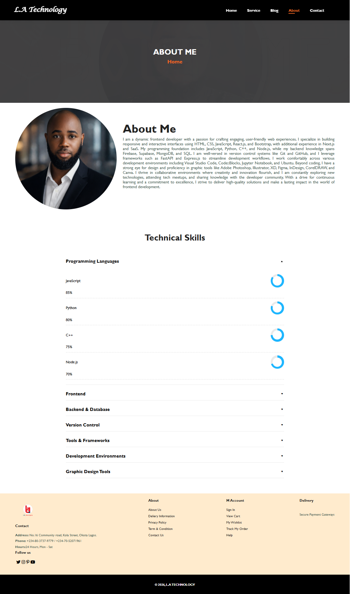
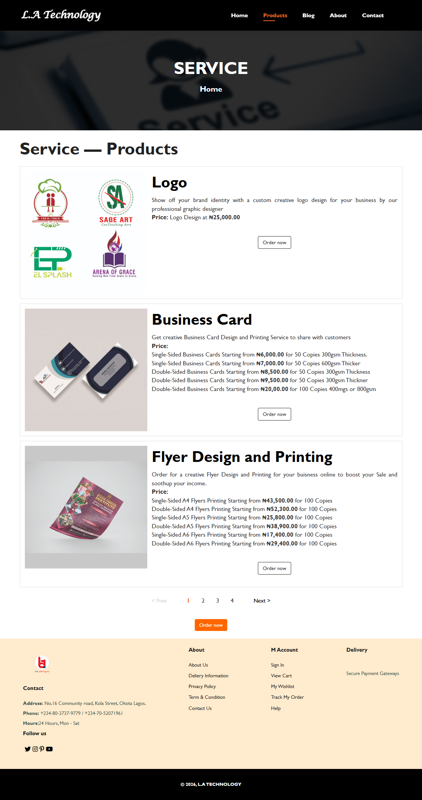

# 🚀 L.A Technologies Printing & Branding Platform

A modern responsive printing and branding business platform featuring dynamic product ordering, smart pricing calculation, secure Paystack payment integration, and backend email processing.

This project demonstrates real-world frontend and backend integration, allowing customers to browse services, select product variations, calculate pricing dynamically, complete payments securely, and submit orders without page reload.

---

# 🌐 Live Demo

👉 https://latechnology.netlify.app

---

# ✨ Features

## 🖥️ Responsive Business Platform
- Modern UI/UX design
- Fully responsive layout
- Mobile-friendly checkout system
- Optimized for all screen sizes

---

## 🛒 Dynamic Product Ordering System
Users can:

- Select products
- Choose product types/variants
- Adjust quantity dynamically
- View automatic price calculations
- Complete secure online payments
- Submit orders without page reload

---

## 💳 Paystack Payment Integration
Integrated Paystack payment gateway for secure online transactions.

### Features include:
- Secure checkout flow
- Dynamic pricing calculation
- Quantity-based pricing
- Product-based payment handling
- Payment reference tracking
- Post-payment order processing

---

## ⚡ Dynamic Pricing Engine
Smart pricing logic powered by JavaScript objects.

### Supports:
- Product variant pricing
- Quantity multiplication
- Automatic total updates
- Real-time checkout calculations
- Flexible scalable pricing architecture

---

## ✉️ Backend Email Processing
- Orders processed after successful payment
- Backend API integration using Express.js
- Automatic email notifications using Nodemailer
- Payment reference included in order details

---

## 🔔 Interactive Modal Checkout System
- Responsive popup checkout modal
- Outside-click detection
- Close button interaction
- Dynamic form updates
- Mobile-optimized scrolling experience

---

## 📄 Smart Pagination with Ellipsis
- Dynamic pagination system
- Ellipsis support for large page sets
- Improved navigation experience
- Better UI scalability

---

## ⚙️ Modular JavaScript Architecture

JavaScript logic is modularized for scalability, readability, and maintainability.

```text
js/
├── modal.js
├── product.js
├── pagination.js
└── LA.js
```

---

# 📸 Screenshots

## 🖥️ Desktop View






---

## 📱 Mobile View


---

# 🛠️ Technologies Used

## Frontend
- HTML5
- CSS3
- JavaScript (ES6)
- Font Awesome
- Boxicons

---

## Backend
- Node.js
- Express.js
- Nodemailer
- dotenv
- CORS

---

## Payment Gateway
- Paystack

---

## Tools
- Fetch API
- Git
- GitHub
- Netlify
- Render

---

# ⚙️ Checkout Workflow

## 1️⃣ Product Selection
User clicks the “Order Now” button for a product.

---

## 2️⃣ Dynamic Modal Opens
The checkout modal opens dynamically with:
- Product name
- Product type options
- Quantity selector
- Automatic price calculation

---

## 3️⃣ Dynamic Price Calculation

Pricing updates automatically based on:
- Selected product type
- Product variation
- Quantity selected

---

## 4️⃣ Secure Payment Processing

Customer completes payment securely using Paystack.

```js
PaystackPop.setup({
  key: "YOUR_PUBLIC_KEY",
  email,
  amount
})
```

---

## 5️⃣ Backend Order Processing

After successful payment:
- Order details are sent to the backend
- Payment reference is included
- Email notification is automatically delivered

---

# 📂 Project Structure

```text
LA-Technologies-Platform/
│
├── index.html
├── products.html
├── about.html
├── contact.html
│
├── css/
│   └── index.css
│
├── js/
│   ├── modal.js
│   ├── product.js
│   ├── pagination.js
│   └── LA.js
│
├── images1/
│
├── screenshot/
│   ├── desktop-homepage.png
│   ├── desktop-contact.png
│   ├── desktop-about.png
│   ├── desktop-service.png
│   ├── mobile-homepage.png
│   ├── mobile-contact.png
│   ├── mobile-about.png
│   └── mobile-service.png
│
├── server/
│   ├── server.js
│   ├── package.json
│   └── .env
│
└── README.md
```

---

# 🔐 Environment Variables

Create a `.env` file inside the `server` folder:

```env
EMAIL_USER=your_email@gmail.com
EMAIL_PASS=your_app_password
PORT=3000
```

---

# 📦 Installation

## Clone the Repository

```bash
git clone https://github.com/amrealstar1st/la-technologies-website.git
```

---

## Navigate Into Project

```bash
cd la-technologies-website
```

---

## Install Dependencies

```bash
npm install
```

---

## Start the Server

```bash
node server.js
```

---

## Open in Browser

```text
http://localhost:3000
```

---

# 🚀 Deployment

## Frontend
Deployed on Netlify

## Backend
Deployed on Render

---

# 🧠 Key Concepts Demonstrated

- Responsive web design
- Dynamic modal systems
- Smart pricing calculation
- Payment gateway integration
- Asynchronous workflows
- API integration
- Modular JavaScript architecture
- AJAX form handling
- Backend email automation
- Responsive mobile checkout UX
- Dynamic DOM manipulation
- Pagination with ellipsis navigation

---

# 🔮 Future Improvements

- Admin dashboard
- Order tracking system
- Database integration
- Customer authentication
- Invoice generation
- Payment verification backend
- WhatsApp order integration
- File upload support
- Customer order history
- Analytics dashboard

---

# 🤝 Contributing

Contributions are welcome.

## Steps:
1. Fork the repository
2. Create your feature branch
3. Commit your changes
4. Push to your branch
5. Open a Pull Request

---

# 👨‍💻 Author

## Adeyemi Seyi Mukhtar
Frontend Developer | Computer Science Student

### 🌐 Portfolio
https://latechnology.netlify.app

### 🐦 Twitter/X
https://twitter.com/amrealstar1st

---

# ⭐ Support

If you found this project helpful, please give it a star ⭐ on GitHub.

⭐ Star | 🍴 Fork | 📢 Share